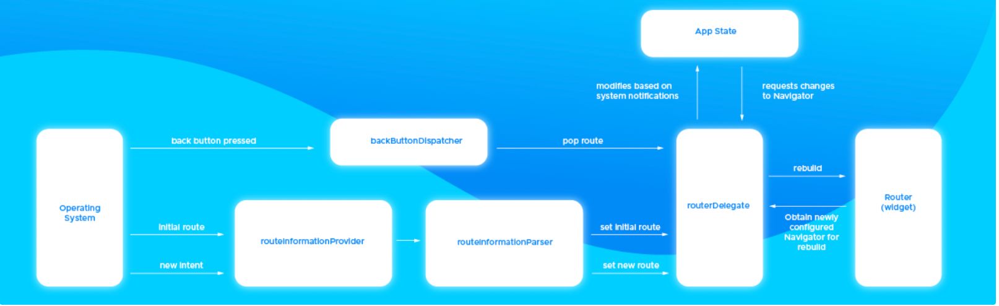

<p>
	
</p>

# Взаимодействие пакета с Router/RouterDelegate/Navigator

Здесь логично будет начать с Router, т.к. именно он аккумулирует в себе работу с  RouterDelegete и Navigator

* ### **Router**

    Пакет не взаимодействует напрямую с Router, для работы с ним он предоставляет объекты AutoRouterDelegate, DefaultInformationParser в купе с AutoRouteInformation.
    Они наследуют классы RouterDelegate и RouteInformationParser соотвественно, которые необходимы для работы Router: 
    
    ```dart
    const Router({
        super.key,
        this.routeInformationProvider,
        this.routeInformationParser,
        required this.routerDelegate,
        this.backButtonDispatcher,
        this.restorationScopeId,
    }) : assert(
         routeInformationProvider == null || routeInformationParser != null,
         'A routeInformationParser must be provided when a routeInformationProvider is specified.',
       ),
       assert(routerDelegate != null);
    ```
    
    То есть в нашем случае мы передаем а MaterialApp.router объекты AutoRouterDelegate и AutoRouteInformation:
    
    ```dart
    MaterialApp.router(
        routerDelegate: _appRoute.delegate(),
        routeInformationParser: _appRoute.defaultRouteParser(),
    )
    ```

* ### **RouterDelegate**:
  
  Как было упомянуто выше, роль RouterDelegate в пакете выполняет объект AutoRouterDelegate:
  
  ```dart
  class AutoRouterDelegate extends RouterDelegate<UrlState> with ChangeNotifier {...}
  ```
  
  Его мы можем предоставить для MaterialApp.router двумя способами:
  
  1. RootStackRouter, который генерится пакетом, предоставляет  метод delegate возвращающий   AoutRouterDelegete. В этом случае предполагается, что вы пользуетесь пакетом, как Navigator 1.0. И вам не требуется более расширенная реализация RouterDelegate.
  2.  Можно создать свой объект AutoRouterDelegate, в том числе и с помощью именнованного контсруктора .declarative.

* ### **Navigator**:
  
   Если вы реализуете навигацию с помощью Router, известно, что взаимодействие с навигатором происходит через RouterDelegate. В нашем случае эту работу выполняет AutoRouterDelegate.
   Копнув несколько глубже, также можно заметить, что и работа с навигатором в пакете делегируется некоему AutoRouterNavigator,  который в последствие окажется в AutoRouterDelegate.
  


| [Назад](./../auto_route/imperative_declarative.md) | [Далее](./../auto_route/generate_routes.md) |
| -------------------------------------------------- | ------------------------------------------- |