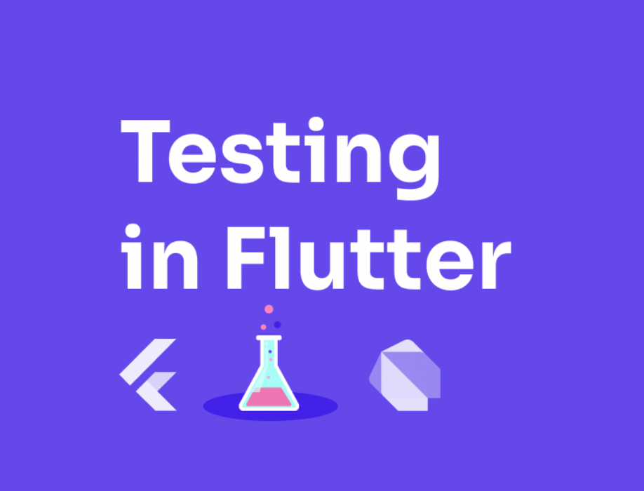

<p>
    
</p>

# Тесты во Flutter

## Flutter предоставляет 4 вида тестирования:

* ### **Unit(блочные) тесты**
* ### **Widget тесты**
* ### **Интеграционные тесты**
* ### **Golden тесты**

### 1. Unit(блочные) тесты:

Тестируют одну функцию, метод, класс. Цель: проверить правильность работы определенной функции, метода, класса. Внешнии зависимости для тестируемого модуля обычно передаются как параметр.

### 2. Widget тесты:

Тестируют один виджет. Цель такого теста, что пользовательский интерфейс виджета выглядит и взаимодействует, как запланировано. Тестирование видежта происходит в тестовой среде, которая обеспечивает контекст жизненного цикла виджета. Также тестиируемый виджет должен иметь возможность получать действия и события пользователя и отвечать на них.

### 3. Интеграциооные тесты:

Тестируют все приложение или его большую часть. Цель интеграционного теста - убедиться, что все тестируемые виджеты и сервисы работают вместе, как ожидалось. Кроме того, вы можете использовать интеграционные тесты для проверки производительности вашего приложения. Как правило, интеграционный тест выполняется на реальном устройстве или эмуляторе.

### Немного о средствах, которые предоставляет Flutter для работы с тестами:

Тесты определяются с помощью функции верхнего уровня `test` внутри которой мы можем выяснить выполняются ли тесты с помощью функции `expect`.

```dart
import 'package:counter_app/counter.dart';
import 'package:test/test.dart';

void main() {
  test('Counter value should be incremented', () {
    final counter = Counter();

    counter.increment();

    expect(counter.value, 1);
  });
}
```

Также есть возможность совмещать несколько однородных тестов в воедино используя функцию `group`:

```dart
import 'package:counter_app/counter.dart';
import 'package:test/test.dart';

void main() {
  group('Counter', () {
    test('value should start at 0', () {
      expect(Counter().value, 0);
    });

    test('value should be incremented', () {
      final counter = Counter();

      counter.increment();

      expect(counter.value, 1);
    });

    test('value should be decremented', () {
      final counter = Counter();

      counter.decrement();

      expect(counter.value, -1);
    });
  });
}
```

Выше перечисленные возможности нам предоставляет пакет `test`.

В случае Widget тестов, нам необходимо воспользоваться пакетом flutter_test, который предоставляет:

* `WidgetTester` - позволяет строить и взаимодействовать с виджетами в тестовой среде.
* `testWidgets` - функция автоматически создает новый `WidgetTester` для каждого тест кейса. Данная функция используется вместо уже знакомой нам функции `test`
* `Finder` -  позволяет поиск виджетов в тестовой среде
* `Matcher` - помогает проверить, находит ли Finder виджет или несколько виджетов в тестовой среде.
* `pumpWidget` - метод предоставляемый `WidgetTeste` строит и отрисовывает предложенный виджет.
* `pump` - запускает перестроение виджета, например в случае если во время тестирование нам нужно вызвать setState для Stateful виджета.

Также стоит вскользь упомянуть о golden тестах. 
Golden тесты — это по сути виджет тесты. Специальный matcher сравнивает виджет с файлом изображения и ожидает, что они идентичны.
Golden файлы — это файлы изображений, созданные из виджета, проверенного вручную.

Из коробки попробовать Golden тесты можно с помощью `matchesGoldenFile` функции. Также есть сторонние пакеты облегчающие работу с golden тестами. Например `golden_toolkit`.

```dart
await expectLater(find.byType(MyApp), matchesGoldenFile('main.png'));
```

Мы используем expectLater, потому что matchesGoldenFile — это асинхронный метод. Метод expectLater работает точно так же, как и метод expect, но возвращает Future, который завершается, когда matcher заканчивает сопоставление.